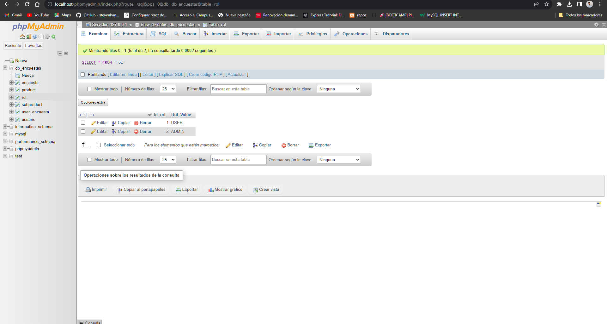
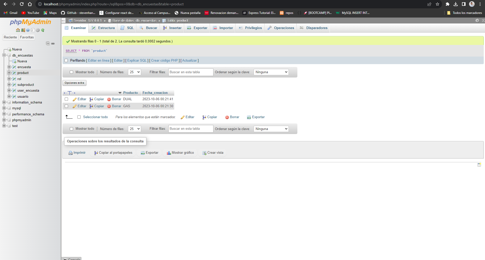
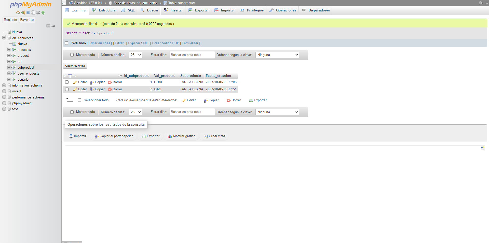
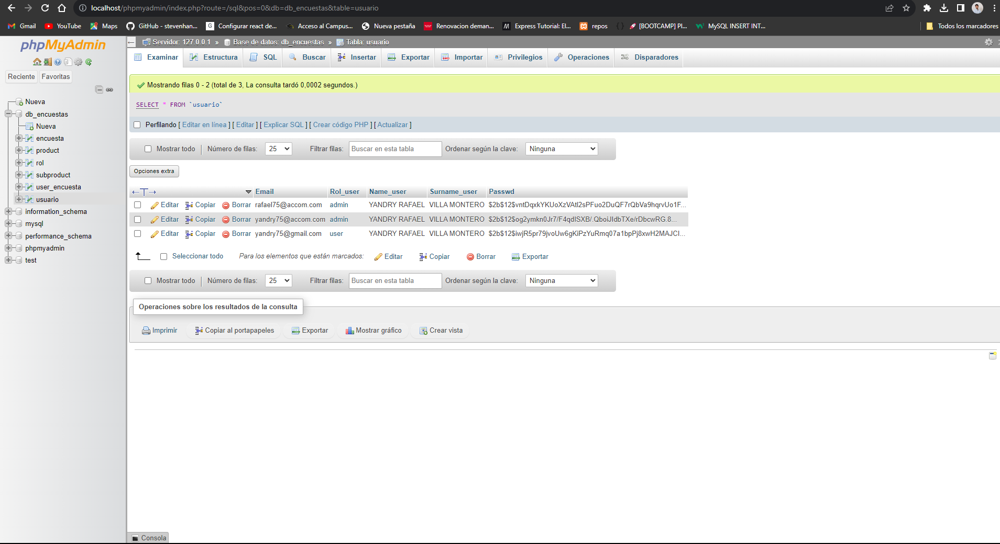
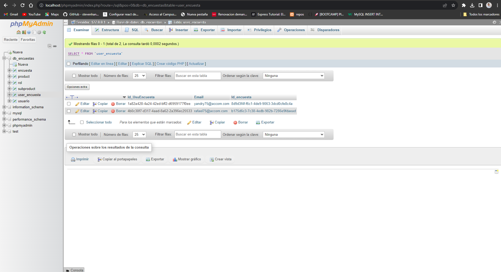

# App Backend Encuestas 

API REST para una aplicacion de encuestas usando Node.Js , Express y JSON WEB TOKEN para las validaciones  

## Version
Version 1.0

## Requisitos previos

Asegúrate de tener Node.js y npm instalados en tu sistema antes de continuar. Si no los tienes instalados, puedes descargarlos e instalarlos desde [https://nodejs.org/](https://nodejs.org/).

## Instalación

1. Clona el repositorio usando este comando : git clone https://github.com/RafaelVillagomezDev/app.git  o descarga el código fuente.

Este comando generará los directorios que se encuentran en esta app .

2. Instala las dependencias usando el comando : npm i 

Este comando generará una carpeta llamada node_modules.

### Pasos a seguir  

1) Para la aplicacion necesitas descargarte el fichero de creacion de la base de datos que esta en este repo con el nombre 
DATABASE_ENCUESTAS.sql
2) Copia y pega en tu base de datos preferida relacional y ejecuta la consulta . 
Ejemplo de base de datos : MYSQL: https://dev.mysql.com/doc/ , POSGRE SQL https://www.postgresql.org/docs/
CONSEJO : La manera mas facil es instalar Xamp https://www.apachefriends.org/es/index.html y usar PhpMyAdmin y ejecutar la sentencia mysql . Si en tu pc ya tienes instalado Mysql , puede que tengas que cambiar el puerto 3010 en xamp 
3) Al no estar subida la Api a un dominio . Necesiat modificar la configuración de la conexion con la base de datos 
Dirigijase a la siguiente ruta tomando como referencia de origen  el fichero readme  : cd ./conecction/bd.js y modifique los siguientes valores segun la configuración que usrted desee 

var connection = {
  host     : process.env.DBHOST,
  user     : process.env.DBUSER,
  password : process.env.DBPASSSWORD,
  database : process.env.DBDATABASE
};

4) Al ser una API según los roles y como he entendido el enunciado  .
Existiran 3 usuarios: 
SUPERADMIN: PERSONA ENCARGADA DE AGREGAR NUEVOS ROLES Y CREAR LOS PRODUCTOS 
AL NO ESTAR CREADO ESTE SUPER USUARIO Y EL ENPOINT CON LA FUNCION DE AGREGAR ROLES Y PRODUCTOS , DEBE DE INSERTARLO USTED MISMO 
TAL Y COMO SE MUESTRA EN LA SISGUIENTES IMAGENES 
ROLES 

PRODUCTOS :

ADMINS: 
LA API PERMITE VARIOS ADMINISTRADORES  AHORA MISMO LA UNICA CONDICION ES REGISTRARSE CON UN EMAIL CUYO DOMINIO SEA "accom.com"
POR EJEMPLO yandry75@accom.com . SI SE REGISTRA CON UN DOMINIO DIFERENTE LA API LE OTORGORA EL ROL DE USER 

USERS: AQUELLOS USARIOS QUE SE REGISTREN CON UN EMAIL DIFERENTE DEL DOMINIO accom.com

5) LANCE A CONTINUACION EL SIGUIENTE CODIGO PARA EJECUTAR EL SERVER DE NODE DE DESAROLLO : npm run devstart

6) PODRAS OBSERVAR QUE ESTA ESCUCHANDO EN EL PUERTO 3445 . SI LO DESEA LO PUEDE CAMBIAR DIRIGIENDOSE : cd ./app.js y cambiandolo 
NOTA : NO SE LO RECOMIENDO YA QUE LE TOCARA MODIFICAR LA RUTA DE LOS ENPOINTS EN CASO DE QUE USE LOCALHOST

## DOCUMENTACION ENPOINTS POSTMAN

DIRIJASE AL SIGUIENTE ENLACE PARA PODER VER LOS ENPOINTS Y SUS RESPUESTAS

https://documenter.getpostman.com/view/18841823/2s9YJhyLbu

## IMAGENES DE BASE DE DATOS COMO REFERENCIA A NIVEL VISUAL 

ROLES:

PRODUCTOS:

SUBPRODUCTOS:

USUARIOS:

USER_ENCUESTA:

## Uso

El proyecto utiliza scripts de npm para simplificar las tareas comunes. A continuación, se muestran los comandos disponibles:

### Iniciar servidor de desarrollo 

Para iniciar un servidor de desarrollo con nodemon , utiliza el siguiente comando: npm run devstart

Esto iniciará nodemon y permitira hot reloading de la aplicación 

## Contribuciones

Si deseas contribuir al proyecto, sigue los siguientes pasos:

1. Haz un fork del repositorio.
2. Crea una nueva rama para tus cambios.
3. Realiza tus cambios y asegúrate de que las pruebas pasen correctamente.
4. Envía una solicitud de extracción (pull request) a la rama principal.

## Licencia

Propiedad de Yandry Villagomez
